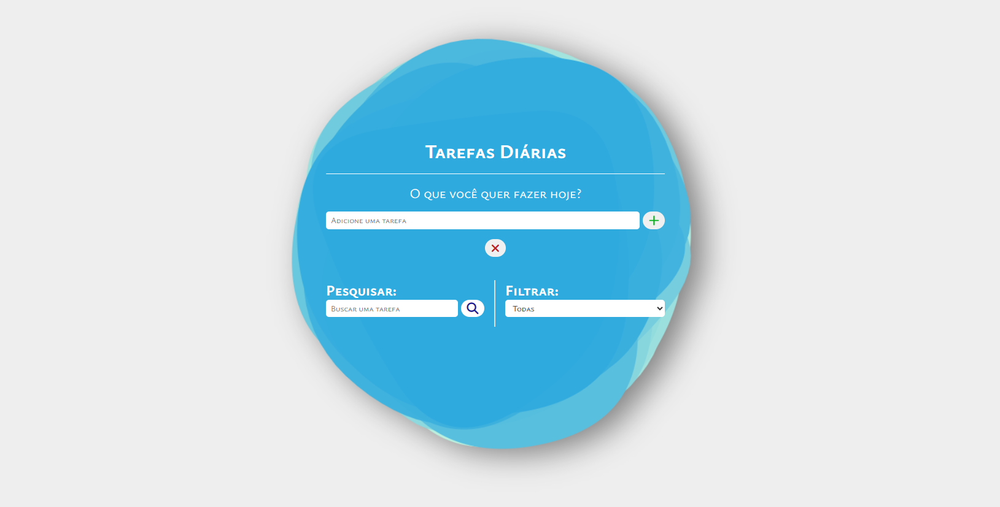
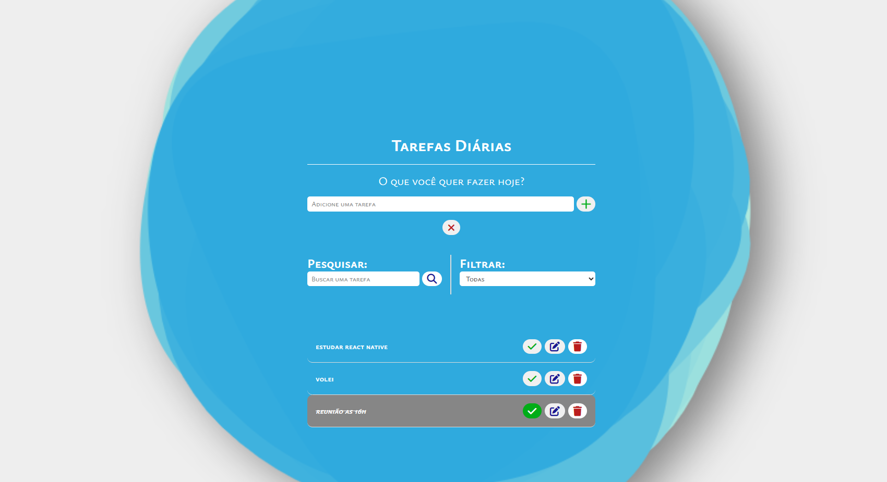
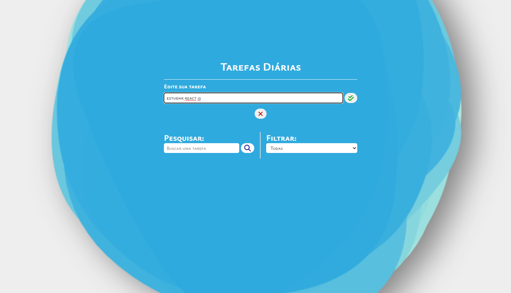
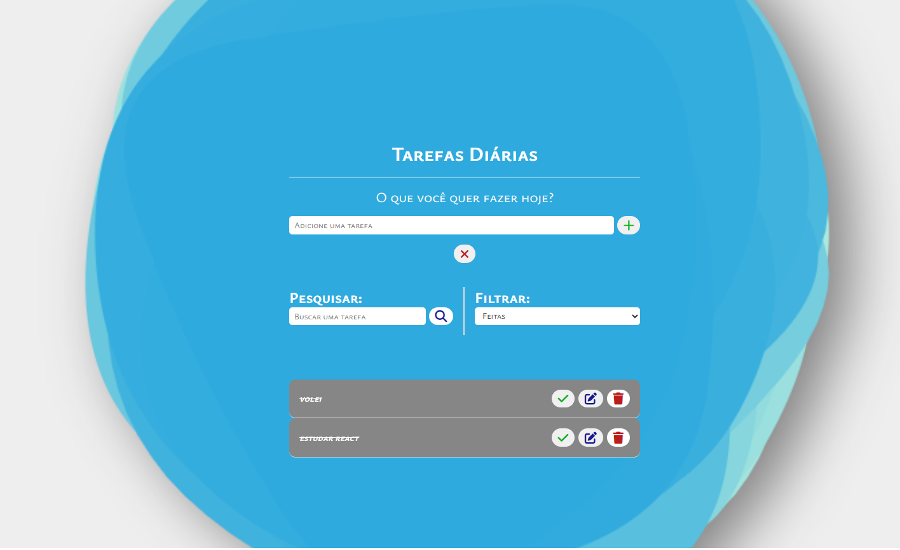

<h1 align="center"> Project To Do List </h1>

Projeto realizado por mim, pelas dicas e segmentos do Professor Matheus Battisti no curso de Front-end 
<a href="https://www.youtube.com/watch?v=HSssE1PRQcA">Estude esse projeto em formato de vídeo clicando aqui.</a>

  <a href="#-tecnologias">Tecnologias</a>&nbsp;&nbsp;&nbsp;|&nbsp;&nbsp;&nbsp;
  <a href="#-projeto">Projeto</a>&nbsp;&nbsp;&nbsp;|&nbsp;&nbsp;&nbsp;
  <a href="#-layout">Layout</a>&nbsp;&nbsp;&nbsp;|&nbsp;&nbsp;&nbsp;
  <a href="#memo-licença">Licença</a>

  

  

  

  

## 🚀 Tecnologias

Esse projeto foi desenvolvido com as seguintes tecnologias:

- HTML e CSS
- JavaScript
- Git e Github

## 💻 Projeto

O ToDoList é uma aplicação web para organização pessoal em que o usuário pode construir uma lista de eventos e tarefas que deve cumprir. Nela pode também editar e exluir as ações propostas. As ações ficam salvas no LocalStorage e não são perdidas ao fechar a página ou recarrega-la. 

The ToDoList is a web application designed for personal organization, allowing the user to create a list of events and tasks to accomplish. The user can also edit and delete the proposed actions. All actions are saved locally in the LocalStorage, ensuring they are not lost when closing or reloading the page.

## 🔖 Layout

Você pode visualizar o layout do projeto através deste link:

https://github.com/matheusbattisti/todo-avancado-js/commit/20dac31d368e6d26f6f4215e5d5acea1c8563d04#diff-60d1c73f64a9165c32e0c42d3a3a6bec1dcc4a466fa5136ddfbe217bbb58d418

https://github.com/matheusbattisti/todo-avancado-js

Feito com ♥ by Lara.
# projecToDoList
